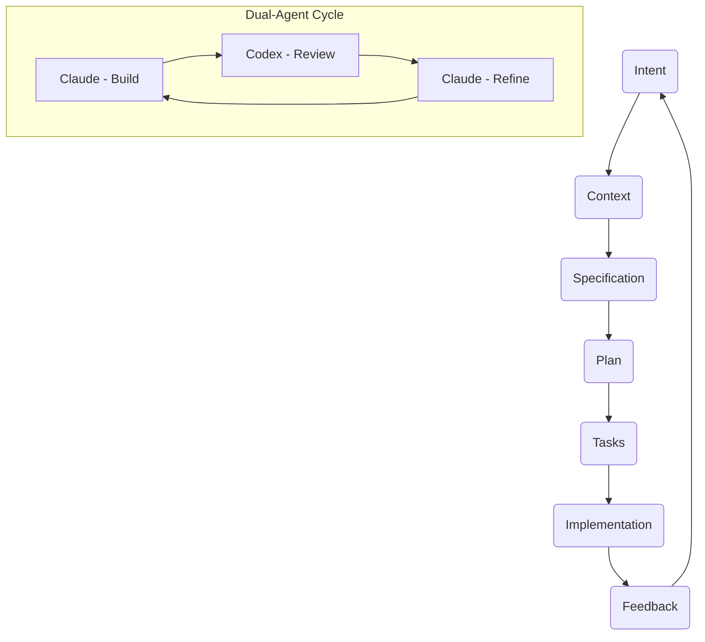
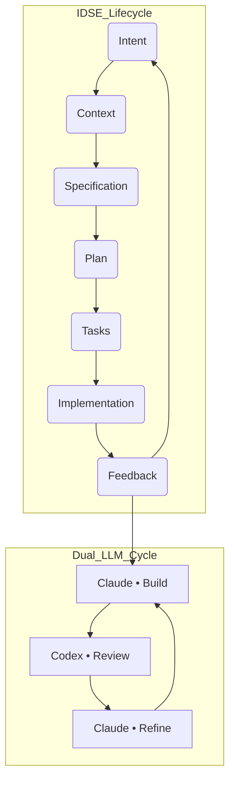

# IDSE Developer Agent

[](https://github.com/tjpilant/idse-developer-agent/actions/workflows/validate-kb.yml)
[](LICENSE)
[](https://tjpilant.github.io/idse-developer-agent/)


> **Intent-Driven Systems Engineering (IDSE)**  
> *Build from purpose. Engineer through context. Deliver with clarity.*

## Table of Contents
1. About
2. Running the Agency
3. Governance Lifecycle
4. Dual LLM Collaboration
5. Validation & CI
6. Contributing

## About

This repository defines the foundation of **Intent-Driven Systems Engineering (IDSE)** and its primary implementation: the **IDSE Developer Agent**, designed to operate with OpenAI’s Custom GPTs.

IDSE unifies:

- **Intent-first reasoning**  
- **Context-aware architectural decision making**  
- **Specification-driven clarity and alignment**  
- **AI-accelerated structured engineering**  
- **Test-first implementation discipline**  
- **Continuous feedback integration**

Together these create a repeatable, consistent, and high-quality development lifecycle across projects.

Use this repo when you want a reliable, repeatable way to turn a loosely worded product idea into a concrete specification, implementation plan, and working code with human-in-the-loop checkpoints along the way.

---

## 🧩 IDSE Governance Layer

This project includes a self-governing IDE automation layer under
`/idse-governance/` which enforces the Intent-Driven Systems Engineering (IDSE)
Constitution for Claude ↔ Codex collaboration.

## 🔁 IDSE Pipeline

The IDSE lifecycle follows a strict but flexible pipeline:

```
Intent
→ Context
→ Specification
→ Implementation Plan
→ Tasks
→ Implementation
→ Feedback → (loop)
```

Each stage produces explicit artifacts:

- `intent.md`
- `context.md`
- `spec.md`
- `plan.md`
- `tasks.md`
- `implementation/` (code, tests, migrations, configs)

This ensures complete traceability from high-level intent to final implementation.
Visual reference: `docs/assets/idse-pipeline.svg`

## Stage-by-stage snapshot

| Stage | Goal | Key questions | Artifact |
| --- | --- | --- | --- |
| Intent | Capture the problem statement, motivation, and constraints. | Why is this being built? What success looks like? | `intent.md` |
| Context | Gather environment, stakeholders, existing systems, and assumptions. | Who depends on this? What integrations exist? | `context.md` |
| Specification | Translate intent + context into requirements and acceptance criteria. | What must be true for this to ship? | `spec.md` |
| Implementation Plan | Choose architecture, outline components, define testing and delivery plan. | How will the work be sequenced? | `plan.md` |
| Tasks | Break the plan into executable steps with ownership and acceptance checks. | What does “done” mean for each task? | `tasks.md` |
| Implementation | Execute tasks, write code/docs, and run validation. | Does the change satisfy intent/spec? | `implementation/` |

Each stage feeds the next; if feedback reveals gaps, loop back to the last stable artifact instead of improvising changes.

---

## Governance Lifecycle



## 🧠 Developer Agent Role

The **Developer Agent** acts as a multidisciplinary engineering partner with the following combined skillsets:

- Senior Full-Stack Engineer  
- Systems Architect  
- API & Database Designer  
- AI/ML Engineer  
- UI/UX-Aware Frontend Developer  

The Agent must:

- Follow the IDSE pipeline strictly  
- Never skip required phases  
- Produce structured artifacts before implementation  
- Use test-first patterns  
- Generate code aligned with intent, context, and specification  
- Respect the IDSE Constitution (guardrails and principles)

The agent is optimized for structured collaboration: it writes drafts for every artifact, asks for missing context, proposes plans with explicit trade-offs, and only proceeds once checkpoints are confirmed.

---

## 📘 Repository Structure

```
idse-developer-agent/
├── docs/                 # Methodology, constitution, pipeline, agent model
├── prompts/              # Custom GPT system prompt(s)
├── kb/                   # Knowledge base for IDSE development
│   ├── templates/        # Templates for intent, context, spec, plan, tasks
│   ├── examples/         # Example walkthroughs and sample artifacts
│   ├── playbooks/        # Operational workflows and guides
├── .github/
│   ├── workflows/        # CI validation (e.g., validate-kb.yml)
└── README.md
```

## Getting started and key docs

- Onboarding: `docs/08-getting-started.md`
- Artifacts comparison: `docs/04-idse-spec-plan-tasks.md`
- SDD to IDSE evolution: `docs/07-sdd-to-idse.md`
- Claude skills guide: `docs/idse-claude-skills-guide.md`
- Example walkthrough: `kb/examples/real-time-notifications.md`
- Playbooks: `kb/playbooks/bug-fix.md`, `kb/playbooks/change-request.md`,
  `kb/playbooks/third-party-api-integration.md`
- Configuration manifest: `idse-agent-config.yaml` (docs, prompts, execution,
  optional integrations)
- Distributed manifest: `idse-agent-config-distributed.yaml` (multi-agent
  orchestration config)

---

## Running the Agency

### 🚀 Using This With an OpenAI Custom GPT

To enable the Agent:

### **1. Create a Custom GPT**  
In the OpenAI interface.

### **2. Paste the Developer Agent system prompt**  
Located at:

```
prompts/custom-gpt-system-prompt.md
```

### **3. Upload the knowledge base**  
Upload:

- `docs/`
- `kb/templates/`
- `kb/examples/`
- `kb/playbooks/`

This provides the GPT full awareness of:

- IDSE methodology  
- Constitution  
- Pipeline  
- Architecture principles  
- Templates and examples  
- Tasking and planning structure  

### **4. Begin prompting using the IDSE Prompting Guide**

The GPT will then fully operate as an IDSE Developer Agent.

### Optional: Configure GitHub action for live repo access

- Import `actions/github-repo-reader.yaml` in the Custom GPT **Actions** tab.
- Set `User-Agent` (e.g., `idse-dev-agent`) and add a PAT for private repos
  (leave blank for public).
- The action exposes `getFileOrDirContents`; file responses are base64 and
  should be decoded. Use it for files not uploaded to the knowledge base.

## Using this with Claude Projects

For Claude-specific setup (Projects, Claude Code, and prompt adaptations), see
`docs/idse-claude-skills-guide.md`.

### Running the pipeline with the agent

1. **Start with intent** – Provide the product/problem statement, constraints, and success criteria. The agent will draft `intent.md` and ask clarifying questions.
2. **Confirm context** – Answer follow-ups so the agent can produce `context.md` (stakeholders, integrations, assumptions, risks).
3. **Lock the spec** – The agent synthesizes requirements in `spec.md` and attaches acceptance criteria. Review before moving on.
4. **Plan and tasks** – The agent drafts `plan.md` (architecture, sequencing, validation) and `tasks.md` (independent, testable steps). Approve and assign.
5. **Implement with checkpoints** – Code changes land in `implementation/` (or your project repo) with tests and notes on deviations from the spec.
6. **Feedback loop** – If something changes, revisit the upstream artifact instead of patching downstream.

### Tips for great outputs

- Provide examples of desired UX/API/architecture when describing intent.
- Share existing system constraints early (APIs, data models, SLAs) so the plan aligns with reality.
- Ask the agent to compare alternatives when making architectural choices; it will document the rationale.
- Keep `tasks.md` granular so work can be parallelized and verified independently.

## Dual LLM Collaboration

### Dual Governance Roles

- **Claude:** Builder and Planner — implements code and documentation under the
  Plan and Implementation stages.
- **Codex:** Reviewer and Validator — audits and enforces compliance during
  Feedback and Validation stages.

## 🧩 IDSE Governance Layer Integration

This repository now includes a **self-governing IDE automation layer** located
in:

```
idse-governance/
```

### Purpose

Transforms VS Code + Claude + Codex + Cursor into a **governed development
workspace** that:

- Tracks state, handoffs, and roles for LLM collaboration
- Automates all IDSE lifecycle transitions
- Enforces constitutional boundaries and CI validation
- Logs every Claude ↔ Codex cycle as a governed artifact

---

## ⚖️ Governance Lifecycle

### 1️⃣ Intent → Context → Specification → Plan → Tasks → Implementation → Feedback

Each IDE agent transition mirrors these seven IDSE stages.

### 2️⃣ Claude ↔ Codex Alternation

- **Claude (builds)** → *handoff* → **Codex (reviews)** → *feedback* → **Claude
  (refines)**
- Each cycle forms one **constitutional feedback loop**
- Cycles are timestamped in `idse-governance/state/state.json`
  (`handoff_cycle_id`)

### 3️⃣ IDE Governance Features

- Atomic handoff automation
- Role switching (Builder ↔ Reviewer ↔ Planner ↔ Implementer)
- Validation scripts (`.cursor/tasks/validate-idse-layer.sh`)
- CI workflow (`.github/workflows/validate-governance.yml`)
- VS Code tasks for handoffs, role changes, and validation

---

## 🧭 Dual-Agent Roles

| Agent      | Primary Stages                        | Responsibility                           |
| ---------- | ------------------------------------- | ---------------------------------------- |
| **Claude** | Specification → Plan → Implementation | Builds, refines, and documents artifacts |
| **Codex**  | Feedback → Validation                 | Reviews, audits, and enforces compliance |

**Both** reference the same governance state file, ensuring that only one LLM
is active at any given time.

---

## 🔁 Governance Diagram



---

## ⚙️ Validation & Automation

Run validations directly inside VS Code:

| Task               | Command                                            | Purpose                         |
| ------------------ | -------------------------------------------------- | ------------------------------- |
| **View State**     | `Tasks: Run Task → View IDSE State`                | Prints current governance state |
| **Validate Layer** | `Tasks: Run Task → Validate IDSE Governance Layer` | Runs integrity script           |
| **Handoff Cycle**  | `Tasks: Run Task → Handoff to Codex/Claude`        | Initiates automated cycle       |
| **Change Role**    | `Tasks: Run Task → Change Role to …`               | Switches governance roles       |

---

## 🌐 Optional: Cloud Deployment with Agencii

1. Sign up at [agencii.ai](https://agencii.ai)
2. Install the GitHub App
3. Push to `main` — Agencii auto-deploys your live agency endpoint

---

## ✍️ Want to Build Your Own Agency?

1. **Fork** this repo.
2. Replace `idse_developer_agent/` with your own logic.
3. Keep the `/idse-governance/` layer intact.
4. Use VS Code + Claude + Codex for governed collaboration.
5. Validate with `Validate IDSE Governance Layer`.

## Validation & CI

- Validate knowledge base: GitHub Action `validate-kb.yml`.
- Validate governance layer: `bash .cursor/tasks/validate-idse-layer.sh` or CI
  workflow `validate-governance.yml`.

---

## Contributing

- **Start a new project** – Copy the templates from `kb/templates/` as a starter kit.
- **Learn the methodology** – Read `docs/01-idse-philosophy.md` and `docs/02-idse-constitution.md` to understand the guiding principles.
- **Follow a walkthrough** – Explore `kb/examples/` to see how intent evolves into a shipped change.
- **Use a playbook** – For common scenarios (feature build, refactor, incident review), start from `kb/playbooks/` and adapt.

Contributions that add examples, playbooks, or refinements to the prompting guide are especially valuable.

---

# 📄 License

MIT License © You
