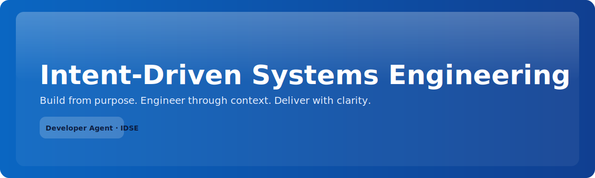

# IDSE Developer Agent

[](https://github.com/tjpilant/idse-developer-agent/actions/workflows/validate-kb.yml)
[](LICENSE)
[](https://tjpilant.github.io/idse-developer-agent/)



# IDSE Developer Agent - Integrations

This directory contains integration packages for deploying the IDSE Developer Agent across different platforms.

## Session-Aware Artifacts
- Reads `.idse_active_session.json` written by the Agency and resolves artifacts in this order: session path → `{stage}/current/` symlink → `{stage}/` → flat file.
- Works with session-scoped docs produced by `idse-developer-agency`; still supports simple/legacy paths as fallback.
- See `docs/session-integration.md` and `INTEGRATION_CONTRACT.md` for the path contract and webhook payloads.

## Three Deployment Modes

| Mode                                             | Use Case                                       | Setup Time |
| ------------------------------------------------ | ---------------------------------------------- | ---------- |
| [**Claude Projects/Skills**](./claude-projects/) | Deep planning sessions with persistent context | 5 min      |
| [**OpenAI Custom GPT**](./custom-gpt/)           | Shareable agent for teams                      | 10 min     |
| [**IDE (VS Code/Cursor/Claude Code)**](./ide/)   | Active development with real files             | 5-15 min   |

## Quick Decision Guide

```
Do you want to...

├─ Share with team who just needs access?
│  └─ → Custom GPT (anyone can use the link)
│
├─ Do deep planning with large context?
│  └─ → Claude Projects (uploads persist, extended context)
│
├─ Work in your editor while coding?
│  └─ → IDE Integration
│     ├─ Using Cursor? → .cursorrules setup
│     ├─ Using Claude Code? → Just clone, it reads AGENTS.md
│     └─ Using VS Code? → Tasks + Copilot instructions
│
└─ All of the above?
   └─ → They're complementary! Use all three.
```

## Directory Structure

```
integrations/
├── README.md                 # This file
├── DEPLOYMENT.md             # Detailed deployment guide for all modes
│
├── claude-skill/             # Claude.ai Skill package
│   ├── SKILL.md              # Skill metadata and instructions
│   └── scripts/
│       ├── generate_artifact.py    # Generate IDSE artifact templates
│       └── validate_artifacts.py   # Validate artifact completeness
│
├── claude-projects/          # Claude Projects setup
│   └── README.md             # Step-by-step Claude Projects guide
│
├── custom-gpt/               # OpenAI Custom GPT setup  
│   └── README.md             # Step-by-step Custom GPT guide
│
└── ide/                      # VS Code / Cursor / Claude Code
    └── README.md             # IDE integration guide
```

## Shared Scripts

The `claude-skill/scripts/` contain utilities usable across all modes:

### generate_artifact.py

```bash
# Generate an IDSE artifact template
python scripts/generate_artifact.py <stage> [--output <path>]

# Stages: intent, context, spec, plan, tasks, test-plan

# Examples:
python scripts/generate_artifact.py intent -o ./artifacts/intent.md
python scripts/generate_artifact.py spec   # prints to stdout
python scripts/generate_artifact.py --list-templates
```

Features:

- Uses `kb/templates/` if found in repo
- Falls back to embedded templates if not
- Adds `[REQUIRES INPUT]` markers for unknowns
- Adds generation timestamps

### validate_artifacts.py

```bash
# Validate IDSE artifacts for completeness
python scripts/validate_artifacts.py <directory> [--json] [--check-ready]

# Examples:
python scripts/validate_artifacts.py ./artifacts/
python scripts/validate_artifacts.py . --json
python scripts/validate_artifacts.py . --check-ready  # just outputs stage name
```

Features:

- Finds `[REQUIRES INPUT]` markers with line numbers
- Checks stage dependencies (can't plan without spec)
- Reports pipeline status
- Outputs JSON for automation

## The IDSE Pipeline

All three modes implement the same methodology:

```
Intent → Context → Specification → Plan → Tasks → Implementation → Feedback
   │         │           │           │        │           │            │
   │         │           │           │        │           │            └── Learn & iterate
   │         │           │           │        │           └── Write code + tests
   │         │           │           │        └── Break into atomic work items
   │         │           │           └── Design architecture & contracts
   │         │           └── Define requirements & acceptance criteria
   │         └── Document environment, constraints, risks
   └── Capture goals, success criteria, scope
```

### Stage Outputs

| Stage         | Artifact       | Key Contents                                    |
| ------------- | -------------- | ----------------------------------------------- |
| Intent        | `intent.md`    | Goal, stakeholders, success criteria, scope     |
| Context       | `context.md`   | Stack, scale, integrations, constraints, risks  |
| Specification | `spec.md`      | User stories, requirements, acceptance criteria |
| Plan          | `plan.md`      | Architecture, components, data model, APIs      |
| Plan          | `test-plan.md` | Test strategy, environments, success criteria   |
| Tasks         | `tasks.md`     | Atomic work items by phase, parallelization     |

### Constitutional Rules

1. **Never skip stages**
2. **Never code without a plan**
3. **Never plan without a spec**
4. **Mark unknowns with `[REQUIRES INPUT]`**
5. **Resolve markers before advancing**

## Combining Modes

The modes are complementary:

**Planning Phase** (Claude Projects)

- Deep sessions with full context
- Upload existing docs, explore options
- Generate artifacts with rich context

**Team Access** (Custom GPT)

- Share with stakeholders for review
- Quick questions about methodology
- Onboarding new team members

**Implementation** (IDE)

- Artifacts live in git with code
- AI sees real codebase context
- Create files directly

## Getting Started

### Fastest Path: Claude Code

```bash
# In your project
git submodule add https://github.com/tjpilant/idse-developer-agent.git .idse

# Start Claude Code
claude

# Ask for help
> "I want to add [feature]. Let's use IDSE methodology."
```

### Most Shareable: Custom GPT

1. Go to [chat.openai.com/gpts/editor](https://chat.openai.com/gpts/editor)
2. Follow setup in `custom-gpt/README.md`
3. Share link with team

### Deepest Context: Claude Project

1. Create Project in claude.ai
2. Upload docs from `docs/` and `kb/templates/`
3. Set custom instructions
4. Start planning sessions

## Related Documentation

- **Methodology**: `../docs/01-idse-philosophy.md`
- **Constitution**: `../docs/02-idse-constitution.md`
- **Pipeline**: `../docs/03-idse-pipeline.md`
- **Prompting Guide**: `../docs/05-idse-prompting-guide.md`
- **Examples**: `../kb/examples/`
- **Playbooks**: `../kb/playbooks/`

---

# 📄 License

MIT License © I M Unlimited LLC tjpilant
