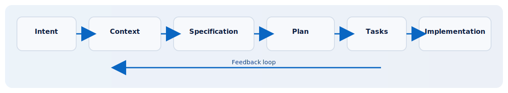

# IDSE Developer Agent Documentation

Welcome to the IDSE knowledge base. This site provides the methodology, constitution, pipeline, prompting guidance, and implementation patterns that power the IDSE Developer Agent.

## Quick Start (Custom GPT)
1. Create a Custom GPT in OpenAI.
2. Paste `prompts/custom-gpt-system-prompt.md` into the Instructions.
3. Upload the contents of `docs/`, `kb/templates/`, `kb/examples/`, and `kb/playbooks/`.
4. Use `docs/05-idse-prompting-guide.md` to craft prompts by stage.

## Core Documents
- [IDSE Philosophy](01-idse-philosophy.md)
- [IDSE Constitution](02-idse-constitution.md)
- [IDSE Pipeline](03-idse-pipeline.md)
- [IDSE Agent Framework](04-idse-agents.md)
- [Specification vs Plan vs Tasks](04-idse-spec-plan-tasks.md)
- [IDSE Prompting Guide](05-idse-prompting-guide.md)
- [IDSE Implementation Patterns](06-idse-implementation-patterns.md)
- [From SDD to IDSE](07-sdd-to-idse.md)
- [Getting Started](08-getting-started.md)

## Additional Guides
- [Claude Skills Guide](idse-claude-skills-guide.md)

## Templates and Examples
- Templates: `kb/templates/` (including `context-template.md`,
  `plan-template.md`, `test-plan-template.md`)
- Examples: `kb/examples/` (e.g., `real-time-notifications.md`)
- Playbooks: `kb/playbooks/` (e.g., bug-fix, change-request,
  third-party-api-integration)

## Contributing
- Please read `CONTRIBUTING.md` and `SECURITY.md` before opening issues or PRs.
- Use the GitHub templates under `.github/` to propose work or submit changes.
