# ⚙️ IDSE Governance Automation Guide

> 📂 **File:** `idse-governance/AUTOMATION.md`
>
> This guide explains the **technical architecture, automation logic, and operational workflows** behind the IDSE Governance Layer.
> It is designed for maintainers, DevOps engineers, and power users integrating Claude ↔ Codex collaboration into their development pipelines.

---

## 🧭 Overview

The IDSE Governance Layer automates dual-LLM workflows inside VS Code or Cursor. It acts as a *meta-operating system* that:

* Tracks state across the IDE using `idse-governance/state/state.json`
* Generates handoff and feedback artifacts from templates
* Enforces boundary rules to prevent accidental cross-contamination
* References IDSE constitutional articles dynamically at runtime

This automation transforms a local development environment into a **self-governing ecosystem** where Claude and Codex operate as alternating constitutional agents.

---

## 🏗️ Architecture Diagram


### Key Components

| Component                                          | Description                                                  | Owner             |
| -------------------------------------------------- | ------------------------------------------------------------ | ----------------- |
| `.cursor/tasks/governance.py`                      | Main automation script for state, handoffs, and role changes | System            |
| `.vscode/tasks.json`                               | Task definitions mapped to governance actions                | Developer         |
| `.cursor/tasks/validate-idse-layer.sh`             | Integrity validator for governance layer                     | CI/CD             |
| `idse-governance/state/state.json`                 | Runtime state register (active LLM, handoff cycle, stage)    | Automation System |
| `idse-governance/templates/handoff_templates/*.md` | Markdown templates for each governance event                 | Claude / Codex    |

---

## 🧩 Automation Functions

### 1️⃣ State Management

`state.json` tracks the current IDE-level governance context:

```json
{
  "active_llm": "claude_code",
  "awaiting_handoff": false,
  "handoff_cycle_id": "2025-12-11T21:45:00Z",
  "layer_scope": "governance",
  "active_stage": "Implementation",
  "role_change_event": null
}
```

### 2️⃣ Handoff Automation

**Purpose:** Manage dual-LLM transitions.

```bash
python3 .cursor/tasks/governance.py handoff claude_code codex_gpt "Implementation complete, begin review"
```

Creates:

* `/idse-governance/feedback/handoff_claude_to_codex_<cycle_id>.md`
* Updates `active_llm`, `awaiting_handoff`, and `handoff_cycle_id`

### 3️⃣ Acknowledgment

```bash
python3 .cursor/tasks/governance.py acknowledge
```

Marks handoff as received and toggles `awaiting_handoff` to `false`.

### 4️⃣ Role & Stage Transitions

Each role or stage change includes constitutional justification:

```bash
python3 .cursor/tasks/governance.py role reviewer
python3 .cursor/tasks/governance.py stage Feedback
```

Example logged event:

```json
"role_change_event": {
  "from": "builder",
  "to": "reviewer",
  "reason": "Scope change (Article IX – Feedback Incorporation)",
  "timestamp": "2025-12-11T22:05Z"
}
```

---

## 🧱 Automation Workflow

```mermaid
sequenceDiagram
participant Claude
participant Codex
participant Governance
Claude->>Governance: handoff() → state update + doc generation
Governance->>Codex: awaits acknowledgment
Codex->>Governance: acknowledge() → active_llm = codex_gpt
Codex->>Governance: handoff() → review summary
Governance->>Claude: active_llm = claude_code
Claude->>Governance: summarize() → generate cycle feedback
```



---

## 🧪 Validation & CI

### Pre-Commit / CI Enforcement

`validate-idse-layer.sh` ensures compliance with:

* `.idse-layer` presence
* Correct directory locations
* No governance files in protected code paths
* Valid JSON schema for `state.json`

```bash
bash .cursor/tasks/validate-idse-layer.sh
```

✅ Output example:

```
✓ Layer marker exists
✓ Config validated
✓ No artifacts in protected paths
✓ Schema OK
```

---

## 🧠 Intelligent Governance Logic

| Logic                         | Description                                                                                            |
| ----------------------------- | ------------------------------------------------------------------------------------------------------ |
| **Atomic Writes**             | All updates to `state.json` are written to a temporary file first, then atomically renamed.            |
| **Template Population**       | Handoff templates dynamically fill placeholders using Python string templates and `datetime.utcnow()`. |
| **Constitutional References** | Role transitions automatically cite relevant IDSE Constitution articles.                               |
| **Guardrails**                | Prevents same-agent handoffs, unacknowledged state edits, and cross-directory contamination.           |

---

## 📊 Feedback Automation

When a complete Claude ↔ Codex cycle is detected, the system auto-generates:

```
idse-governance/feedback/handoff_summary_<cycle_id>.md
```

using `handoff_feedback_template.md`. This includes metrics, reflection, and role/stage deltas.

---

## 🧭 Maintenance Guide

| Task         | Script / Command                                    | Notes                             |
| ------------ | --------------------------------------------------- | --------------------------------- |
| View state   | `python3 .cursor/tasks/governance.py view`          | Safe read-only command            |
| Change stage | `python3 .cursor/tasks/governance.py stage <stage>` | Requires justification            |
| Change role  | `python3 .cursor/tasks/governance.py role <role>`   | Auto-links constitutional article |
| Validate     | `bash .cursor/tasks/validate-idse-layer.sh`         | Used in CI / pre-commit           |

---

## 🧩 Extending Automation

### Add New Governance Events

* Extend `governance.py` with new commands (e.g., `sync`, `pause`, `metrics`)
* Add corresponding templates under `/idse-governance/templates/`
* Reference new articles in `docs/02-idse-constitution.md`

### Integrate External Systems

* Use the state API or export command to sync with dashboards or CI logs.
* Possible outputs: JSON summary, Slack webhook, or GitHub issue triggers.

---

## 🔒 Safety & Compliance

* No external API calls during state updates.
* All governance actions are local, atomic, and reversible.
* Compliance with Articles II–IX of the IDSE Constitution.
* Explicit separation between **governance metadata** and **application code**.

---

## 🧠 Summary

This automation layer ensures:
✅ Deterministic, documented dual-agent collaboration
✅ Zero-conflict transitions between Claude and Codex
✅ Constitutional traceability for every role and stage
✅ IDE-based feedback loop closure

> *By codifying governance in code, the IDE becomes an intelligent system that enforces discipline, intent alignment, and feedback accountability.*
