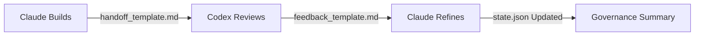

# 🚀 IDSE Governance Layer – Quick Start Guide

Welcome to the **Intent-Driven Systems Engineering (IDSE) Governance Layer**, the automation framework that enables Claude ↔ Codex collaboration inside your IDE.

> 🧠 **Goal:** Turn VS Code + Cursor into a *self-governing development environment* where all actions follow the IDSE Constitution.

---

## 🧩 What You Can Do

| Action               | Description                                | Command / Task                             |
| -------------------- | ------------------------------------------ | ------------------------------------------ |
| 🧭 View State        | See current LLM, stage, and handoff status | `python3 .cursor/tasks/governance.py view` |
| 🔁 Handoff to Codex  | Pass control to Codex for review           | `Handoff to Codex` (VS Code Task)          |
| 🔄 Handoff to Claude | Return control for refinement              | `Handoff to Claude` (VS Code Task)         |
| 🧑‍💻 Change Role    | Switch between Builder, Reviewer, Planner  | `Change Role to …` (VS Code Task)          |
| 🧪 Validate Layer    | Check for governance or boundary issues    | `Validate IDSE Governance Layer`           |

---

## ⚙️ Setup Instructions

1️⃣ **Activate Environment**

```bash
python -m venv .venv
source .venv/bin/activate
pip install -r requirements.txt
```

2️⃣ **Initialize Governance State**

```bash
python3 .cursor/tasks/governance.py view
```

> Confirms that the active LLM is `claude_code` and layer scope is `governance`.

3️⃣ **Validate Integrity**

```bash
bash .cursor/tasks/validate-idse-layer.sh
```

> Ensures `.idse-layer`, `state.json`, and config rules are correct.

4️⃣ **Run a Handoff Cycle**

* Claude builds → `Handoff to Codex`
* Codex reviews → `Handoff to Claude`
* System generates feedback summary → `handoff_summary_<cycle_id>.md`

---

## 🔁 Governance Lifecycle Overview



1. Claude builds according to plan → hands off to Codex.
2. Codex reviews for architecture, tests, and CMS compliance.
3. Codex returns feedback → Claude refines Plan or Tasks.
4. System logs the cycle in `idse-governance/feedback/`.

---

## 🧱 Folder Map

```
idse-governance/
├── protocols/                # Rules & handoff definitions
├── templates/handoff_templates/  # Claude ↔ Codex templates
├── feedback/                 # Generated artifacts
├── state/state.json          # Current IDE state
└── .idse-layer               # Boundary marker
```

---

## ⚖️ Governance Rules (At a Glance)

1. **One LLM Active at a Time** – `active_llm` defines control.
2. **Awaiting Handoff = Lockdown** – Prevents concurrent edits.
3. **No Governance Files in Code Paths** – Enforced by config.
4. **Every Handoff = Traceable** – All cycles timestamped.
5. **Role Changes Cite Articles** – Constitutional alignment.

---

## 🧭 Example Workflow

**Claude (Builder):**

```bash
python3 .cursor/tasks/governance.py handoff claude_code codex_gpt "Feature complete; ready for review."
```

**Codex (Reviewer):**

```bash
python3 .cursor/tasks/governance.py acknowledge
python3 .cursor/tasks/governance.py handoff codex_gpt claude_code "Review done; feedback logged."
```

**System:**

```bash
python3 .cursor/tasks/governance.py summarize
```

> Creates `handoff_summary_<cycle_id>.md` automatically.

---

## 🧩 Tips

* Use the VS Code **Task Runner** (Ctrl+Shift+P → “Tasks: Run Task”) for simplicity.
* Always check `.cursor/config/idse-governance.json` before adding new code.
* Governance artifacts live *only* in `/idse-governance/`.

---

## 🧠 Learn More

* 📜 `idse-governance/protocols/handoff_protocol.md`
* 🧩 `idse-governance/templates/handoff_templates/README.md`
* 🧪 `idse-governance/AUTOMATION.md`
* ⚖️ `docs/02-idse-constitution.md`
* 🧭 `docs/03-idse-pipeline.md`

---

> *The Quick Start is your gateway to using IDSE as an operational IDE layer — bridging reasoning (Claude) and implementation (Codex) in a governed feedback loop.*
