# IDSE Governance Layer README

> 🧠 **Intent-Driven Systems Engineering (IDSE) Governance Layer**
>
> This directory implements the **governance automation system** for coordinating multi-agent work between Claude (Anthropic) and Codex (OpenAI) inside the **VS Code / Cursor IDE environment**.
>
> It turns your development workspace into a **self-governing IDE**, enforcing constitutional workflow integrity, automating dual-agent handoffs, and recording state transitions.

---

## 🧭 Purpose

The IDSE Governance Layer provides a **meta-operating system** for IDE-based collaboration. It:

* Tracks active LLM agent state (Claude ↔ Codex)
* Automates handoffs and stage transitions
* Enforces the 7-stage IDSE pipeline (Intent → Context → Spec → Plan → Tasks → Implementation → Feedback)
* Validates constitutional compliance through CI and boundary checks
* Prevents accidental cross-contamination between governance artifacts and project code

This layer operates **outside application runtime** and should never contain executable source code.

---

## 🏗️ Directory Structure

```
idse-governance/
├── README.md                        # (This file)
├── protocols/
│   └── handoff_protocol.md           # Full dual-LLM governance protocol
├── templates/
│   └── handoff_templates/            # Handoff + feedback templates
│       ├── claude_to_codex_template.md
│       ├── codex_to_claude_template.md
│       └── handoff_feedback_template.md
├── state/
│   └── state.json                    # Active LLM + governance metadata
├── feedback/                         # Generated artifacts from governance cycles
│   └── handoff_summary_<cycle_id>.md
├── QUICK_START.md                    # New user guide
├── AUTOMATION.md                     # Deep dive into governance scripts
└── .idse-layer                       # Governance boundary marker
```

---

## ⚙️ Key Components

| Component                  | Description                                                 | Maintainer           |
| -------------------------- | ----------------------------------------------------------- | -------------------- |
| **handoff_protocol.md**    | Defines dual-agent rules, schema, and guardrails            | IDSE Developer Agent |
| **handoff_templates/**     | Blueprint templates for Claude ↔ Codex communication        | Governance System    |
| **state.json**             | Tracks which LLM is active and current IDSE stage           | Automation Script    |
| **governance.py**          | CLI + VS Code task automation for handoffs and role changes | Automation Script    |
| **validate-idse-layer.sh** | CI/Pre-commit layer validation                              | CI System            |

---

## 🔁 Governance Lifecycle

### 1️⃣ IDSE Flow

```
Intent → Context → Specification → Plan → Tasks → Implementation → Feedback
```

Each IDE agent transition mirrors these seven stages.

### 2️⃣ Dual-LLM Alternation

```
Claude builds → Handoff → Codex reviews → Feedback → Claude refines
```

Each full loop = one constitutional cycle, logged in `handoff_cycle_id`.

### 3️⃣ Visual Diagram

```mermaid
flowchart LR
    subgraph IDE [VS Code / Cursor IDE]
    A[Claude: Implementation & Planning] -->|Claude → Codex Handoff| B[Codex: Review & Feedback]
    B -->|Codex → Claude Return| A
    end
    IDE --> C[(state.json)]
    C --> D[(feedback logs)]
    D --> A
```



---

## 🪞 Dual Governance Roles

| Agent      | Role              | Typical Stage                  | Responsibilities                                       |
| ---------- | ----------------- | ------------------------------ | ------------------------------------------------------ |
| **Claude** | Builder / Planner | Intent → Plan → Implementation | Generate specs, build features, document reasoning     |
| **Codex**  | Reviewer / QA     | Implementation → Feedback      | Audit, test, refine, validate architectural compliance |

Roles can dynamically change mid-cycle through governed role-change events (`role_change_event` in `state.json`).

---

## 🧩 Integration Points

### IDE

* **VS Code / Cursor Tasks**: `governance.py` commands accessible from Task Runner.
* **Automation**: Python scripts handle handoffs, validation, and role transitions.

### LLMs

* **Claude** (Anthropic) and **Codex** (OpenAI) cooperate via structured markdown handoff templates.
* Each agent’s behavior and scope are defined by `AGENTS.md`.

### Repository

* **Boundary Enforcement**: `.cursor/config/idse-governance.json` ensures governance files stay isolated.
* **State Tracking**: `idse-governance/state/state.json` manages workflow authority.

---

## ✅ Governance Rules Summary

1. Only one LLM is active at a time (`active_llm`).
2. `awaiting_handoff = true` locks modification until acknowledged.
3. Handoff documents are created from templates, not ad hoc notes.
4. Every handoff cites the current IDSE stage and `plan.md` reference.
5. Role changes must cite an IDSE constitutional article.
6. Governance artifacts must never appear in `/src/`, `/app/`, or `/implementation/`.

---

## 🧠 How to Use

1. Run governance validation:

   ```bash
   bash .cursor/tasks/validate-idse-layer.sh
   ```
2. View or change IDE state:

   ```bash
   python3 .cursor/tasks/governance.py view
   python3 .cursor/tasks/governance.py handoff claude_code codex_gpt "Reason for handoff"
   ```
3. Access tasks via VS Code:

   * `Handoff to Codex`
   * `Acknowledge Handoff`
   * `Change Role to Planner`
   * `Validate Governance Layer`

---

## 📜 References

* **IDSE Constitution:** `docs/02-idse-constitution.md`
* **IDSE Pipeline:** `docs/03-idse-pipeline.md`
* **Agency Swarm SOP:** `docs/idse-agency-swarm-sop.md`
* **Governance Config:** `.cursor/config/idse-governance.json`
* **Agent Roles:** `AGENTS.md`

---

> 🧩 *This governance layer transforms your IDE into an intent-driven, self-governing workspace where every LLM action is constitutional, traceable, and reversible.*
