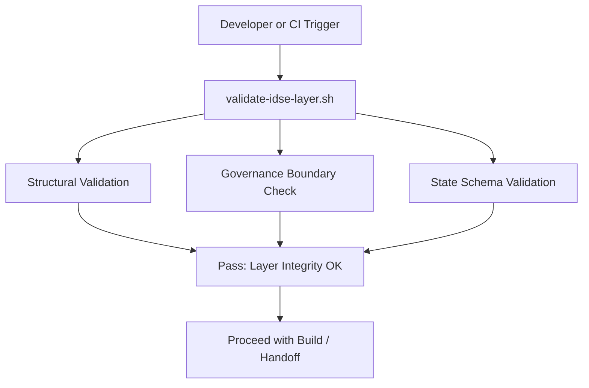

# 🧪 IDSE Governance Validation & QA Guide

> 📂 **File:** `idse-governance/VALIDATION.md`
>
> This guide documents the **validation, testing, and integrity enforcement mechanisms** that ensure the IDSE Governance Layer remains compliant, isolated, and fully operational.

---

## 🧭 Purpose

The validation system ensures that the **governance layer** operates independently from application code and adheres to IDSE constitutional rules. It runs automatically in CI or manually via VS Code Tasks.

**Goals:**

* Prevent cross-contamination between governance artifacts and project code.
* Verify the structural and logical integrity of `state.json`.
* Confirm correct deployment of governance markers and configs.
* Maintain continuous IDSE compliance during development.

---

## ⚙️ Validation Components

| File                                   | Description                            | Purpose                                      |
| -------------------------------------- | -------------------------------------- | -------------------------------------------- |
| `.cursor/tasks/validate-idse-layer.sh` | Core shell script for integrity checks | Ensures all governance rules are followed    |
| `.cursor/config/idse-governance.json`  | Governance enforcement configuration   | Defines protected paths and governance scope |
| `idse-governance/state/state.json`     | Source of truth for active state       | Validated against schema and timestamps      |
| `CI pipeline (optional)`               | GitHub Actions / local pre-commit      | Runs validation automatically before merge   |

---

## 🔍 Validation Workflow



---

## 🧩 Validation Script Logic

### 🔸 Step 1 – Governance Layer Notice

Ensures all critical governance files include the required banner:

```
# GOVENANCE LAYER NOTICE
```

If missing, CI fails with clear remediation instructions.

### 🔸 Step 2 – Layer Marker Presence

Checks for `.idse-layer` in the repository root or `idse-governance/`:

```
✔ Layer marker file exists
```

### 🔸 Step 3 – Configuration Consistency

Validates `.cursor/config/idse-governance.json` fields:

* `idse_layer_root`
* `protected_paths`
* `governance_paths`
* `rules`

### 🔸 Step 4 – State Validation

Verifies `state.json` fields:

```json
{
  "active_llm": "claude_code",
  "awaiting_handoff": false,
  "layer_scope": "governance",
  "active_stage": "Implementation"
}
```

All fields must exist and contain valid values.

### 🔸 Step 5 – Protected Path Scan

Ensures no governance metadata is inside code directories like:

```
src/, lib/, app/, backend/, idse_developer_agent/, implementation/
```

Failing this test triggers a warning or CI block.

---

## 🧠 Example Output

```
🔍 Validating IDSE Governance Layer...
✓ Governance layer notice found
✓ .idse-layer marker present
✓ Governance config validated
✓ state.json structure OK
✓ No governance artifacts in protected paths

✅ IDSE Governance Layer validation passed!
```

---

## 🧪 QA Logic and Metrics

| Metric                    | Description                           | Target        | Validation Method               |
| ------------------------- | ------------------------------------- | ------------- | ------------------------------- |
| **Governance Boundary**   | No cross-directory contamination      | 100%          | Path scan                       |
| **State Integrity**       | All required JSON fields valid        | 100%          | JSON schema check               |
| **Automation Sync**       | Timestamps + cycle IDs updated        | < 1 min drift | Timestamp diff                  |
| **Feedback Loop Closure** | All handoffs produce feedback summary | 100%          | File existence + naming pattern |

---

## 🔄 Continuous Integration Example (GitHub Actions)

```yaml
name: Validate IDSE Governance Layer
on:
  push:
    branches: [ main ]
  pull_request:
    branches: [ main ]

jobs:
  validate:
    runs-on: ubuntu-latest
    steps:
      - uses: actions/checkout@v3
      - name: Run validation
        run: bash .cursor/tasks/validate-idse-layer.sh
```

---

## 🧰 Developer Tools

Run validations manually:

```bash
bash .cursor/tasks/validate-idse-layer.sh
```

Or from VS Code:

* **Ctrl+Shift+P → Tasks: Run Task → Validate IDSE Governance Layer**

---

## ⚠️ Common Issues

| Issue                        | Cause                                  | Resolution                                 |
| ---------------------------- | -------------------------------------- | ------------------------------------------ |
| ❌ Missing Governance Banner  | File not updated after template change | Add banner manually or rerun generator     |
| ❌ state.json Invalid         | Manual edits or interrupted process    | Restore from backup and rerun automation   |
| ⚠️ Governance File in `src/` | Misplaced file                         | Move to `/idse-governance/` and revalidate |

---

## 🧩 Future Enhancements

* Schema auto-validation via `jsonschema` Python library
* Governance drift detection (compare timestamps to commits)
* IDE-based auto-remediation alerts
* Integration with Claude/Codex feedback metrics

---

## ✅ Summary

The validation layer ensures your **IDSE Governance System** is:

* Self-verifying 🧩
* Constitutionally compliant ⚖️
* IDE-integrated 💻
* CI-ready 🚀

> *Every governance artifact, handoff, and role change remains traceable, auditable, and constitutionally sound.*
